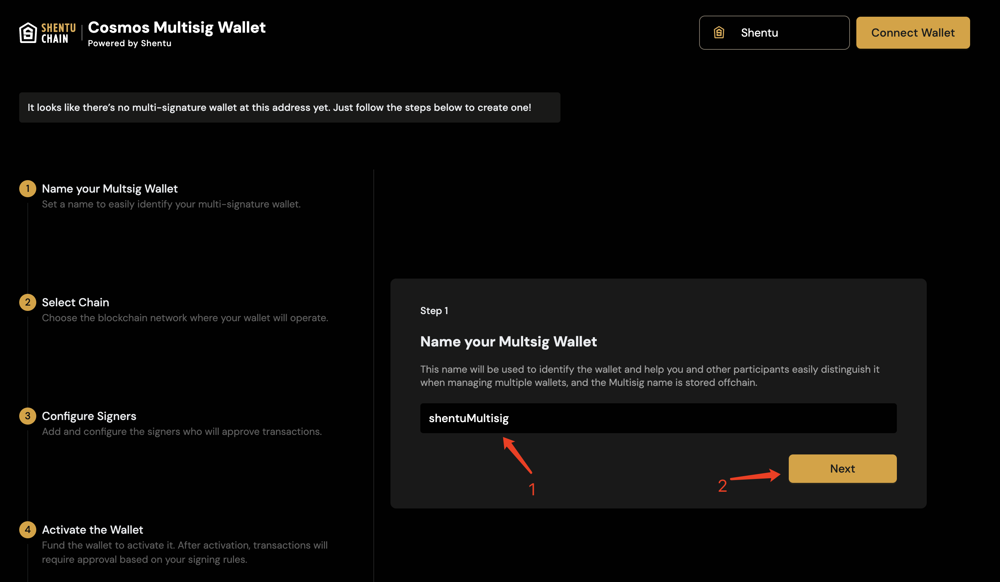
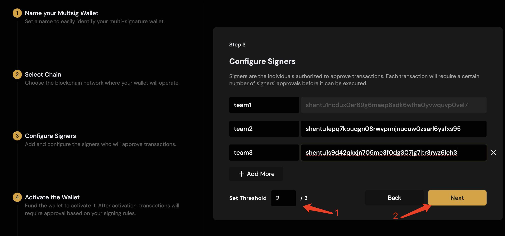
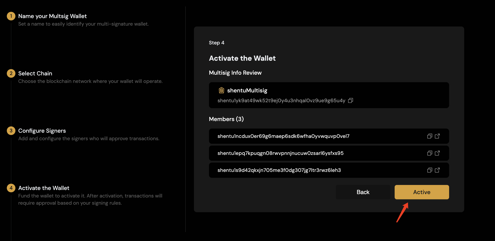
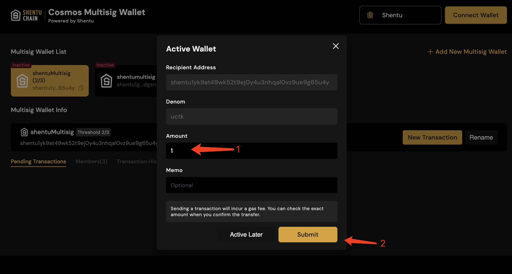

# Overview

Multisignature accounts are accounts that are generated from multiple public keys. A multisig necessitates that any transaction made on its behalf must be signed by a specified threshold of its members.

A common use case for multisigs is to increase security of a signing account, and/or enable multiple parties to agree on and authorize a transaction.

The first step is to create a multisig signing key by using the public keys of all possible signers and the minimum threshold of addresses that are needed to sign any transaction from the account. The threshold can be the same amount as the total number of addresses comprising the multisig.

Source: [Cosmos Multisig Guide](https://docs.cosmos.network/main/user/run-node/multisig-guide#overview)

# Step by step guide to multisig Account

## Create a Multisig Account 

### Login multisig page
1. Open https://multisig.shentu.org/
2. Select network 
2. Connect wallet
 

### Create multisig account
1. Add multisig name
2. Add multisig numbers
3. Active multisig account

#### Add multisig name
   
#### Add multisig numbers
   
#### Active multisg
Activation is for the multisig account to be visible on the chain
   

