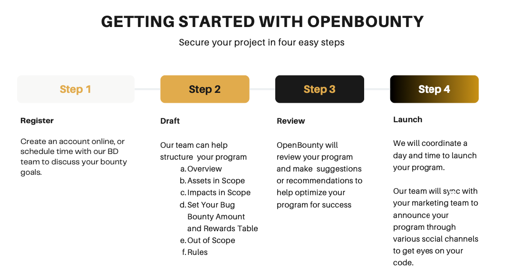

## Brief introduction
There are 4 parts covered in the FAQs.
- Hosting a Bug Bounty
- Designing a Bug Bounty 
- Running a Bug Bounty
- Communication Regarding a Bug Bounty 

## Hosting a Bug Bounty 
### Question: Why should I use OpenBounty over other platforms?
**Answer:** Our team consistently collects input and conducts extensive research to guarantee that the ethical hackers and the projects we support have an exceptional experience while using our platform.

### Question: What if I already host my program with another Bug Bounty platform?
**Answer:** The primary objective of every Bug Bounty agreement is to attract the attention of reputable whitehat hackers. There's no reason why every project offering a bug bounty wouldn't consider hosting on multiple platforms. Whitehat hackers often have preferences for certain platforms, and limiting the hosting to a single source may restrict exposure and the additional security benefits that a bug bounty can provide.

If you're currently self-hosting or promoting your bug bounty through another platform, we encourage you to reach out to our Business Development team at [bd@openbounty.io](mailto:bd@openbounty.io). We can discuss ways to expand your program's reach and potentially reduce your current fees in the process.

### Question: What are the fees or associated costs for launching on your platform? 
**Answer:** There are zero upfront or monthly fees to consult, onboard, and host a bug bounty with OpenBounty. We are a performance-based organization, meaning we charge a performance fee in addition to valid reports paid to our whitehats. This fee helps cover ongoing platform improvement and hosting, as well as the resources for attracting and continuously building our hacker talent pool.  

### Question: We have an upcoming audit. Should we launch our bug bounty program at the same time?
**Answer:** We recommend launching a bug bounty program after your audit is complete and published. This helps reduce duplicate efforts by auditors and whitehats. Including your published report in your bug bounty program is ideal for communicating with hackers about known issues.

### Question: How do I get started with OpenBounty? 
**Answer:**  Getting started is easy. With just four simple steps, our team will be there to guide you through the process.

## Program Design
### Question: What specific assets or applications should I include in the bug bounty program?
**Answer:** You should list any public asset or application you would want the whitehat community to review. 

### Question: Are there any areas that are out of scope for the program?
**Answer:** Your team and OpenBounty can collaborate to determine this. Bug Bounties are regarded as public contracts, so it's crucial to clearly outline what is included and excluded from the scope of your specific program. This clarity instills confidence in whitehat hackers when reviewing your code and enables OpenBounty to act as a mediator for any potential disputes.

### Question: How are bugs classified in terms of severity (e.g. critical, high, medium, low, informational)?
**Answer:** Bugs are classified are identified into 5 level scales.
- Critical 
- High
- Medium
- Low
- Informational

More detailed information is provided [here](https://learn.shentu.technology/docs/OpenBounty/Finding/Finding%20Severity).

### Question: How should we determine the bug bounty reward amount? What rewards will be offered for different severity levels of bugs?
**Answer:** Determining the proper rewards to incentivize hackers to report responsibly and secure your project is critical to determining a strong bug bounty program. During the development of your program, the OpenBounty team can help offer advice on proper amounts and calculations for rewards by severity level that incentivize Whitehats while remaining within your budget. 

Reward levels are always determined by the projects and should be stated clearly and concisely when the program is launched so that everyone's expectations are met. 

## Running a Bug Bounty Program
### Question: How long will the bug bounty program run?
**Answer:** A bug bounty should be considered an ongoing part of your security posture.  

### Question: Will there be specific times when the program is active or is it ongoing?
**Answer:** A bug bounty is hosted 24/7. We can work with your team to establish short-term incentives or bonuses if your project is updated, refreshed or upon launch if you would like to get hackers' attention on new releases.    

### Question: How often should I expect to receive bug reports?
**Answer:** There is no set number of reports you will receive. Most activities are determined by the reputation of your project, the clarity of your program, and the incentives offered for hackers to review your program. 
### Question: Does OpenBounty conduct KYC on your hackers?
**Answer:** We currently do not offer KYC verification on our platform. This is a feature we have under consideration on our roadmap. 

### Question: How can I be sure that hackers will not exploit vulnerabilities found on OpenBounty? Do you conduct KYC or other forms of assurance?
**Answer:** Theoretically, a Bug Bounty Program is created to reduce the risk of a potential vulnerability being exploited by bad-faith actors. We currently do not conduct KYC on our whitehats although it is a feature we are considering on our roadmap. 
Our team is vigilant about our community and encourages everyone (whitehats and projects) to act in good faith. We have established a set of Community Guidelines that we ask all researchers to adhere to. Any infraction is considered serious and either a warning or removal from our platform will occur immediately as OpenBounty deems necessary.  

### Question: A Whitehat has found a valid vulnerability, what happens now?  
**Answer:** It is the expectation of OpenBounty and the Whitehat Community that your team will actively work with the Whitehat to acknowledge the valid report and act according to your Bounty terms. 

The reports are considered IP of the Whitehat unless explicitly noted on your program details. You should work with the Whitehat to discuss how to responsibly publish their findings. 

## Communication Channels
### Question: What channels will be available for communication between researchers and me as the client?
**Answer:** The main communication channel is our dashboard. Clients have visibility into all the feedback and messages exchanged with the researchers.

### Question: Is there a dedicated point of contact for handling submissions and queries?
**Answer:** The main communication channel is our dashboard. Once logged into your dashboard, clients can review all the submissions.

## Reporting and Disclosure
### Question: How should researchers report vulnerabilities?
**Answer:** They can select the relevant bounty and click **submit findings** then they simply follow the instructional process to complete the submission of their findings.

### Question: What is the expected timeline for acknowledging and addressing reported issues?
**Answer:** An SLA is established during the setup of the bounties to determine this. For reports deemed Critical or High we recommend responding within 3 days or less. For reports deemed Medium, Low, or Informational we recommend 7 days or less. 

### Question: How will the disclosure process work once a bug is fixed?
**Answer:** Once the findings are in the **closed** and **paid** status, the project side has the option to publish the findings on the blockchain.

## Platform Features and Support
### Question: What features does the platform offer to manage and track bug submissions?
**Answer:** The main communication channel is our dashboard. If necessary, the OpenBounty platform can offer bug triage support.

### Question: Is there any technical support available for both clients and whitehats during the program?
**Answer:** Yes. Technical support is available for both clients and ethical hackers throughout the program.