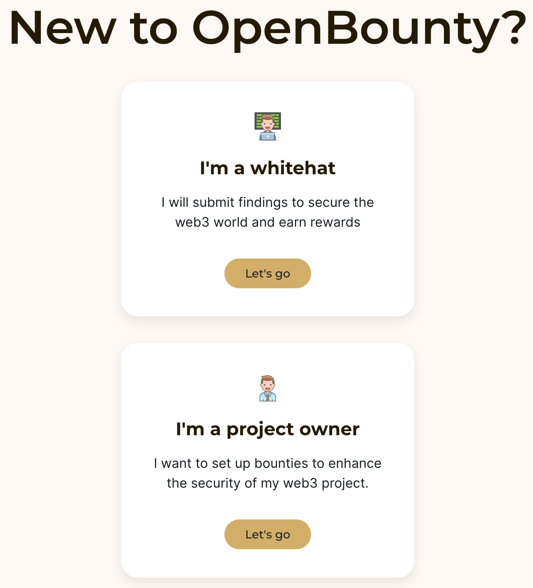

## How to Sign up for OpenBounty

Unleash your security expertise and earn rewards with OpenBounty, the leading bug bounty platform.

Signing up for OpenBounty is quick and easy. Follow these steps to join our global community of security researchers and start making a difference:

## Sign up

Visit our website [OpenBounty](https://openbounty.shentu.technology) and click on the ***Sign up*** button.
Enter your email address, password, and other required information.
Choose a nickname that reflects your expertise and professionalism.

## Choose Your Account Type

OpenBounty has two types of accounts: Whitehat and Project Owner.

- If you need to submit a finding to get a bounty, you need to register a Whitehat account.
- If you need to conduct a security assessment on your project, you need to register a Project Owner account.

## Input your account information

You need to provide your account information in the following page.

You can also fill in the referral ID. Different rewards will be given to the referral according to our rules.

For specific rules, please refer to this link: https://openbounty.shentu.technology/referral

## Verify Your Email address

Once you've created your account, you'll receive an email with a verification link.

Click on the link to verify your email address and go back to our page to complete your registration.

## Log in Again to Continue

For safety reason, you need to log in again to continue.

Since you have not yet linked your wallet, you need to log in using your email and password.

## Connect your wallet

After logging in, you need to connect your wallet.

The reason for connecting your wallet is that OpenBounty will encrypt and store each Finding on the blockchain, so it can better protect your rights.

At the same time, after connecting your wallet, you can also use the wallet login function.

⚠️ Note: Since both our finding and Bounty Program will be submitted to the blockchain, you can **no longer** modify your wallet address.

## All done! Have fun!

Now that you have completed all the steps, you can start earning rewards by uploading your findings!

## Call to Action:

[https://openbounty.shentu.technology](https://openbounty.shentu.technology)

Together, we can make the internet a safer place.
