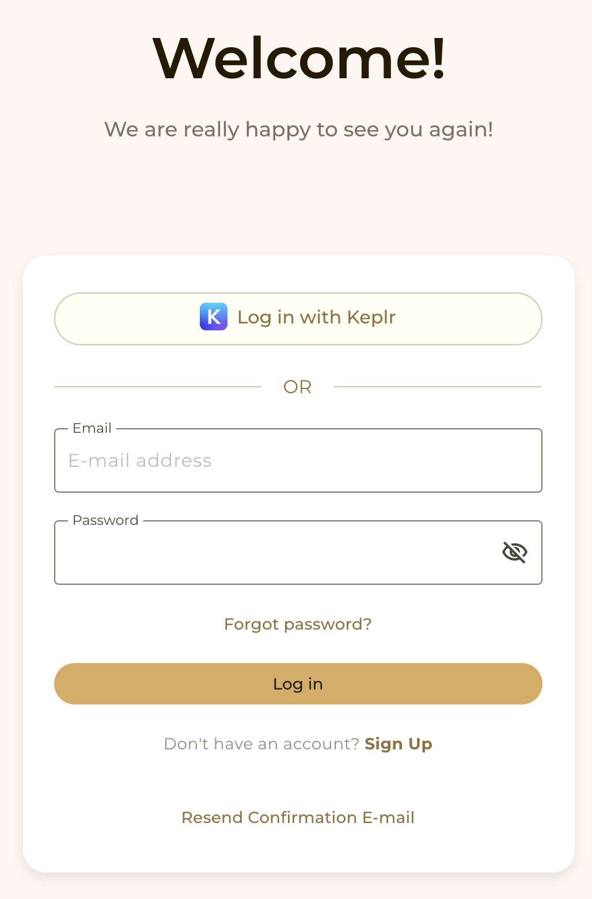
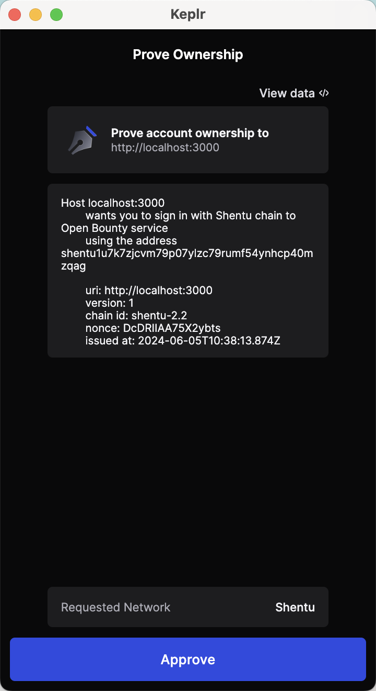

## Log in with Email address
You can choose to log in using your email address.

Simply put, you only need to enter your email address and password.

## Log in with Keplr wallet
You may remember that when you created your account, you were asked to bind your Keplr wallet. Therefore, you only need to log in using the bound wallet address.

When logging in, you only need to sign with your wallet public key. Therefore, you don’t need to pay any fees.

⚠️ Note: Currently we only support Keplr wallet.

