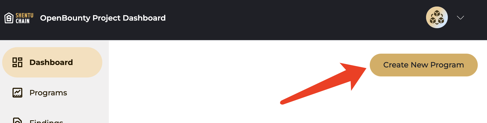
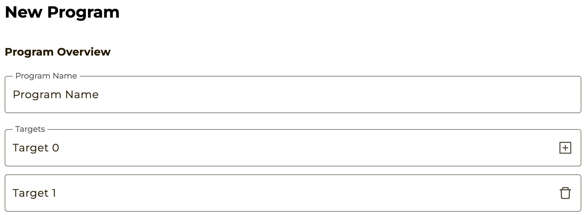
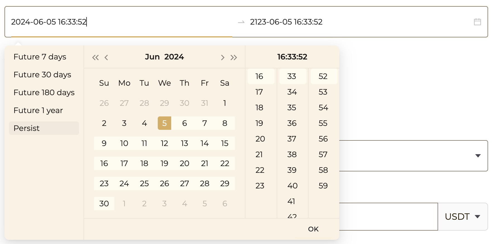
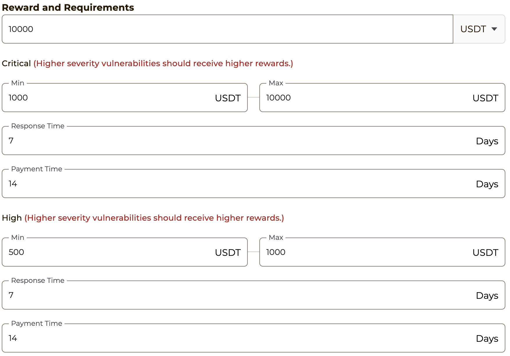
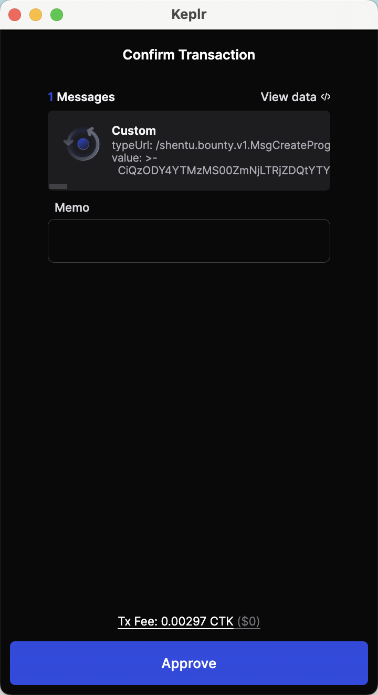
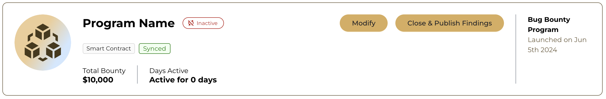
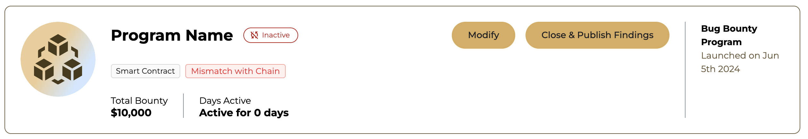

## Launching a Bounty Program on OpenBounty
Empower your organization's security posture and protect your assets by creating a bug bounty program on OpenBounty.

Bug bounty programs have become an invaluable tool for organizations of all sizes to proactively identify and address security vulnerabilities in their software and systems. By opening your codebase to the scrutiny of a global community of skilled security researchers, you can gain valuable insights into potential security risks, take proactive measures to remediate them, and enhance your overall security posture.

OpenBounty provides a comprehensive platform for creating, managing, and running effective bug bounty programs. Our user-friendly interface, streamlined processes, and expert support make it easy for you to launch and manage your program effectively.

Here's a step-by-step guide to creating a bug bounty program on OpenBounty:

## Create new program
After creating an account and logging in, you can find the Create New Program button in the upper right corner of the homepage.

Click it to create a new project.

## Enter your program details
### Targets
Fill in your project name and the target you need to protect. You can also add or delete targets to be protected by clicking the button on the right.

When whitehats submit a finding, they will select a target to submit.

### Duration
You need to enter the duration of the bounty program. After the bounty expires, it will no longer be visible.

### Reward and Requirements
According to OpenBounty rules, we divide the severity of Finding into five levels: Critical, High, Medium, Low, and Informational.

You need to set a different bounty for each level of Severity.

⚠️ Note: More severe Findings need to be given more bounties. Therefore, you cannot pay less bounty for Critical severity finding than High Severity Finding.

- **Response Time**: The Response Time here is how long you promise to respond after whitehats uploads or updates a finding. We recommend that you set it to 7 days.
- **Payment Time**: The Payment Time here is how long you promise to pay the promised reward after a finding is reviewed and approved. We recommend that you set it to 14 days.

## Submit on chain
Once you have completed and click Submit, we will put your Bounty Program on the blockchain to ensure transparency.

You need to use the wallet bound during registration to sign and confirm this operation.

You can also check your bound address at https://openbounty.shentu.technology/cl-dashboard/settings.

### Wait for admin to verify your bounty program
You have completed all the required operations!

In order to protect the interests of whitehats, we will set the newly created Bounty Program to Inactive status and review your created Bounty Program as soon as possible. After the review is completed, your Bounty Program will be set to Active by our administrator. At this time, everyone can see your Bounty Program!

## Errors

### Mismatch with Chain
After submitting your Bounty Program, if you fail to place it on the blockchain correctly, your project may show as Mismatch with Chain. Don't worry, you can just click Mismatch with Chain and re-place your Bounty Program on the blockchain.

## Let's secure Web 3 world together
By following these steps and leveraging OpenBounty's comprehensive platform, you can successfully launch and manage a bug bounty program that enhances your organization's security posture, protects your valuable assets, and builds a reputation for commitment to security excellence.

Remember, investing in security is an investment in your organization's future.