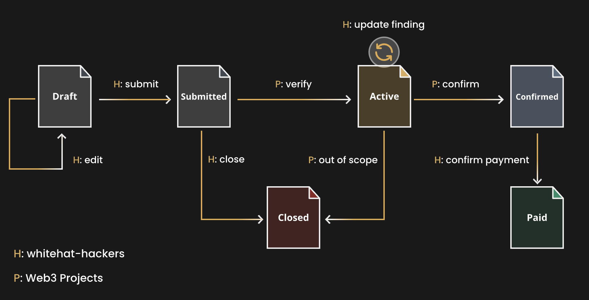

## Finding State Machine
The finding state machine on OpenBounty follows a structured workflow to ensure efficient bug bounty management. The process begins with the finding in the **Draft** status, where whitehats can edit and submit their findings. Once submitted, the status changes to **Submitted**.

Projects on the platform then verify the findings and can transition them to either **Active** if it qualifies as a valid issue or **Closed** if it is determined to be not applicable or non-reproducible.

During the **Active** status, whitehats have the opportunity to update their findings. If the web3 project confirms the finding as a bug, the status changes to **Confirmed** However, if the web3 project determines that the finding is out of scope or cannot be reproduced, it can also be changed to **Closed**.

After confirmation, if the web3 project pays the reward and the whitehat confirms the receipt of the reward, the finding's status can be changed from **Confirmed** to **Paid** This structured workflow ensures clarity and transparency throughout the bug bounty process, fostering effective collaboration between whitehats and web3 projects on OpenBounty.

