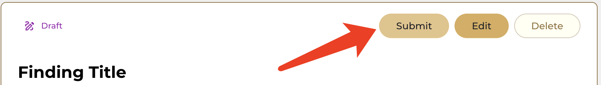

## Submitting a Finding on OpenBounty
Unleash your security expertise and earn rewards by submitting your findings on OpenBounty.

Once you've successfully identified a vulnerability in a bounty program, it's crucial to submit a comprehensive and well-structured report to the program organizers. This report will serve as the foundation for evaluating the validity and severity of your finding, ultimately determining your eligibility for a reward.

Follow these steps to effectively submit a finding on OpenBounty.

## Find a Bounty Program that interests you
After logging in, click ***Bounties*** on the sidebar to view all Bounty Programs. You can also click https://openbounty.shentu.technology/wh-dashboard/bounties to go directly to the page mentioned before.

Click ***View Details*** to enter the Bounty Program you are interested in.

## Submit a finding
Click Submit a Finding to enter the submit finding page

## Enter all the fields
Please fill in all the blanks to submit your finding.

- **Severity** describes the severity of the finding you want to release.
- **Impacts** are the impacts of the finding you want to release.
- **PoC** stands for Proof of Concept. You need to provide a method to reproduce this finding.
- **Ethereum Chain Wallet Address** is the wallet address you use to **receive rewards** from the Bounty Program. We strongly recommend that you use your personal wallet address instead of the address provided by the exchange.

⚠️ Note: To avoid spam, the same finding can only be submitted once. The same description and proof of concept will be considered the same finding.

## Submit on blockchain
After you submit your finding, we will ask you to sign your finding using the wallet connected to your account and confirm submission to the blockchain.

Don't worry, your finding will be encrypted. Before receiving the bounty, only the Bounty Program Admin, the platform Admin and yourself can see your finding.

You will get the following notification when your finding is successfully submitted to the blockchain.

## Wait for verification
Please wait for the Bounty Program Admin to review your finding. The Bounty Program Admin will review and evaluate your finding within the agreed time.

When the Bounty Program Admin deems your finding valid, they will set your finding to active status.

## Errors

### Failed to submit to the blockchain
If your finding is not submitted to the blockchain correctly, you may see this prompt. The content of the prompt may vary depending on the situation.

Don't worry, your submission is still there.

Please go to ***Submissions*** in the sidebar and click ***Draft*** to view the draft. Your incorrectly submitted Finding will be saved here as a draft.

You only need to click on the Finding you need to submit and click ***Submit*** to resubmit your Finding.

## All done!
Thank you for your valuable contribution!

Remember, your contributions are valuable in making the internet a safer place.